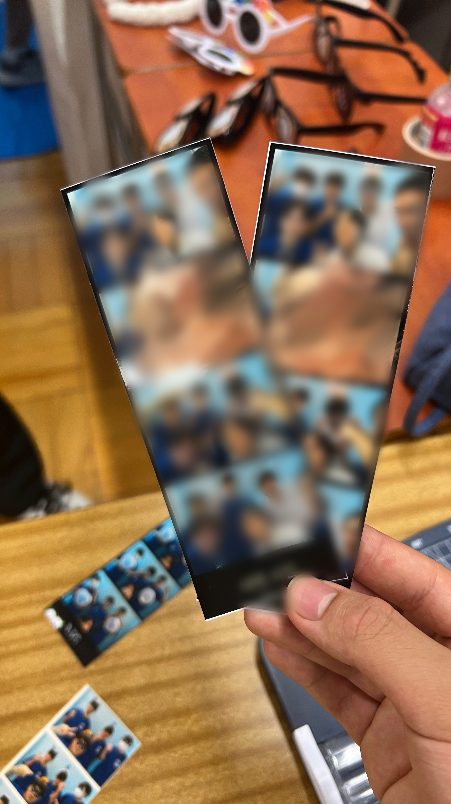
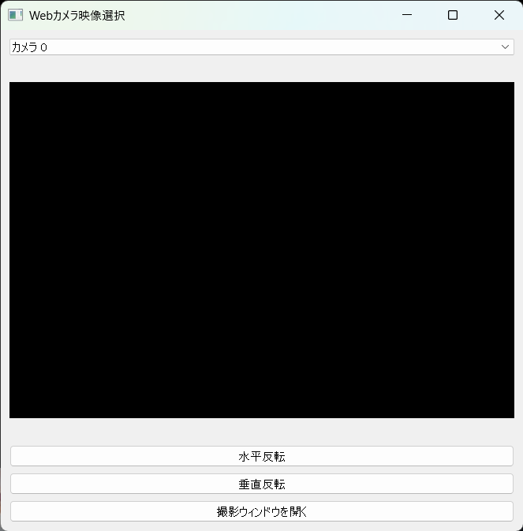
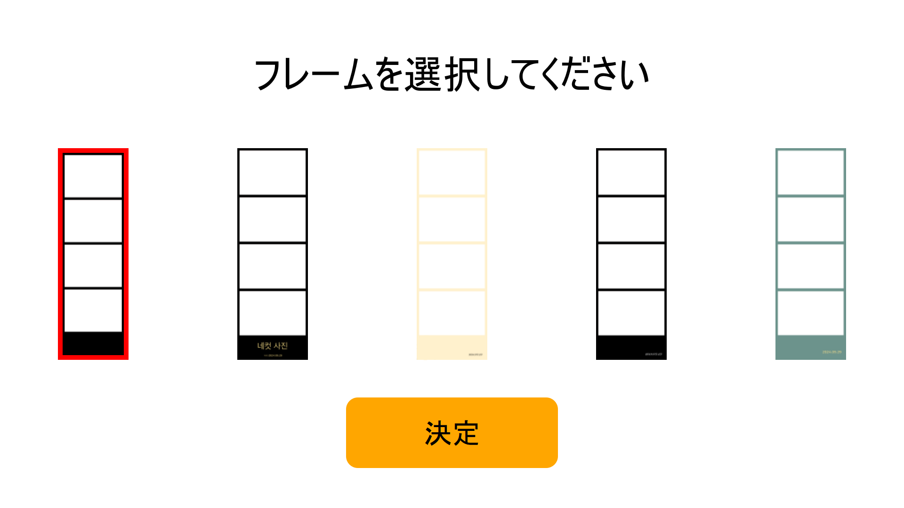

# 📸 本格的なフォトブースシステム‼  
## 🎓教育機関向けに無償提供中✨

🎉 **文化祭などで使える本格的なフォトブースシステムアプリです。**  
ゲームセンターにあるあの撮影機械を文化祭等で本格再現・運営できます！
簡単操作で写真を撮影し、作成可能なオリジナルフレームを選択すると合成されてます。
合成されて出来上がった画像はQRコードを読み取りスマホに保存したり、プリンターと接続することで自動で印刷することができます！

## 実際に高校の文化祭で使用され、約500人の来場者に撮影して頂き大盛況でした！  
>下の画像をクリックすると、文化祭で使われた様子を動画でご覧いただけます 🎥👇

<table>
  <tr>
    <td align="center">
      
      
🎥 動画を見る

    </td>
    <td align="center">
      
      
📸 完成写真例

    </td>
  </tr>
</table>

---

## 🚀 特徴

- **本格的で使いやすいUI**  
  初めての人でも簡単に操作可能！

- **カスタマイズ可能なフレーム**  
  フォトフレームは透過PNG画像で作成しているため、配布しているテンプレートを使い、オリジナルフレームを作成することで自由に変更可能。

- **自動印刷 ＆ QRコードで画像受け取り対応**  
  プリンターを接続すると自動でプリントすることができます。
  アプリを実行している端末と同じWi-Fiに接続されている端末ならQRコードを読み取ることで撮影した画像をデータで受け取れます。
  
- **強固なセキュリティ**  
  撮影した写真は撮影終了後に削除ボタンを押すことで削除するシステムになっているため、端末に残ることはありません。
  QRコードで写真を渡す際、同じWi-Fiに接続している第三者の端末から傍受されないよう、URLにランダムな文字列を挟み、HTTPS通信をすることでセキュリティを確保しています。
  
- **学校の端末に対応**  
  本アプリはインストール不要なため、管理者権限を必要としません。

---

## 🖥️ 動作環境

| **項目**        | **必要スペック**                          | **推奨スペック**                         |
|-----------------|---------------------------------------|---------------------------------------|
| **OS**         | Windows 10 (64bit)                   | Windows 10/11 (64bit)                   |
| **CPU**        | Intel Core i5 以上                    | Intel Core i7 以上                    |
| **メモリ**     | 4GB 以上                              | 8GB 以上                              |
| **ストレージ**  | 1GB 以上の空き容量                     | 1GB 以上の空き容量                        |
| **ディスプレイ** | 1280x720 以上の解像度                | 1920x1080 フルHD                      |
| **カメラ**      | USB カメラ、または内蔵カメラ         | 高解像度USBカメラ、スマートフォンのカメラ               |

---

## 📥 ダウンロード
⚠️現在提供準備中です。
[**➡ 利用申請はこちら**](https://forms.gle/zBkWD56zqQSj91559)  
フォームから利用申請をお願いします。利用申請が完了し、利用者資格を満たしている者と確認できましたら、入力されたメールアドレス宛にダウンロードリンクを送付します。

---
## 利用者条件・規約

本システムは、以下の条件を満たす教育機関の関係者に提供されます。

### 1. 利用者資格
利用者は、以下の条件を満たす者に限られます：
- **教育機関に所属している者**（例：高校、大学、専門学校等の教職員または学生）
- **非営利目的での使用**に限ります。本システムは営利目的で使用することはできません。

### 2. ライセンス
- 本システムの全ての著作権およびライセンスは、提供者に帰属します。  
- 教育機関に所属する者に対してのみ使用許可を与えます。営利目的での使用は禁じられています。
- **改変禁止**: 本システムのソースコードや構成を変更、再配布することはできません。

### 3. 使用範囲
- 本システムは、教育機関内での使用に限られ、個人または営利団体への提供はできません。
- 教育機関のイベントや活動においてのみ使用を許可します。
- **文化祭での使用**においては、以下の制限があります：
  - 文化祭における費用回収は、**印刷用紙代、インク代、装飾費用**等、実際にかかった経費を超えてはいけません。過剰な金額を回収することは禁止されています。

### 4. 禁止事項
- 本システムの商業目的での利用、販売、配布は禁止されています。
- 教育機関外での利用、または教育機関以外の個人による使用は認められていません。
- 本システムを改変、再配布、または商業的な目的で使用することは固く禁止されています。

本規約を遵守し、適切な利用をお願いいたします。

## 🎨 スクリーンショット

<table>
  <tr>
    <td align="center">
      
      
⚙️ 設定画面

    </td>
    <td align="center">
      
      
🖼️ フレーム選択画面

    </td>
  </tr>
</table>

---

## 🌟 今後の予定

- 多言語対応
- スタンプ機能の追加
- リアルタイムでのエフェクト適用機能

---

## 📧 質問・お問い合わせ

ご質問やサポートが必要な場合は、以下のメールアドレスまでお気軽にお問い合わせください。

✉️ **メールアドレス**: [bueno114bs@gmail.com](mailto:bueno114bs@gmail.com)

※ 返信には数日かかる場合があります。あらかじめご了承ください。
